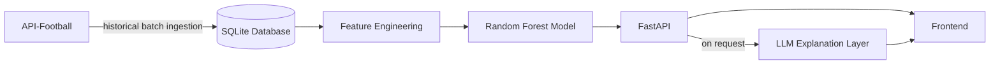

# Football Match Predictor

Premier League match outcome predictor combining an automated data pipeline, engineered features, a Random Forest classification model, and an LLM-powered explanation layer.

---

## Overview

This project predicts Premier League match outcomes (home win / away win / draw) using historical fixture and head-to-head data. It's built as a full pipeline rather than a single notebook: automated data ingestion, a normalized relational database, derived feature engineering, a trained classification model, a FastAPI backend, and a frontend to browse historical fixtures alongside the model's predictions and natural-language explanations.


> **Note:** this project covers **historical, already-played fixtures only** (2022/23–2024/25 seasons). It is not a live prediction tool for upcoming matches — see [Known Limitations](#known-limitations--future-improvements).

---

## Architecture



**Data flow:**
1. **Ingestion** — historical fixtures and head-to-head data are pulled from API-Football via a rate-limit-aware, resumable batch process, and stored as raw JSON before being parsed.
2. **Database** — a normalized SQLite schema (Teams, Seasons, SeasonsPlayed, Fixtures, HeadToHead, Predictions) stores the processed data, accessed via SQLAlchemy.
3. **Feature engineering** — recent form, head-to-head performance, and goals-based features are derived per fixture directly from stored data, using only information available before each fixture's date (no data leakage).
4. **Model** — a Random Forest classifier is trained on the engineered features and evaluated using Time Series Cross-Validation; predictions for test-set fixtures are stored alongside the features that produced them.
5. **API** — FastAPI serves paginated fixture/prediction data and, on request, natural-language explanations generated by an LLM.
6. **Frontend** — a Bootstrap-based web page for browsing fixtures by season, comparing actual vs. predicted results, and viewing on-demand explanations.

---

## Tech Stack

- **Language:** Python
- **Database:** SQLite, accessed via SQLAlchemy (ORM)
- **API layer:** FastAPI, with Pydantic for request/response validation
- **Data source:** [API-Football](https://www.api-football.com/) (free tier)
- **Modelling:** scikit-learn (Random Forest classifier)
- **LLM integration:** Anthropic (Claude) — used to generate natural-language explanations of predictions
- **Frontend:** HTML, vanilla JavaScript, Bootstrap

---

### Requirements
- Python 3.11+
- An API-Football account and API key ([free tier](https://www.api-football.com/))
- An Anthropic API key (for the explanation feature)

### Installation

```bash
git clone <repo-url>
cd football-match-predictor
pip install -r requirements.txt
```

### Environment variables

Create a `.env` file in the project root:

```
API_FOOTBALL=your_api_football_key_here
ANTHROPIC_API_KEY=your_anthropic_api_key_here
```

### Database setup

> **Note:** Historical ingestion is rate-limited by API-Football's free tier (100 requests/day) — see [Data Source & Constraints](#data-source--constraints). Populating the database from scratch takes several days of repeated runs, not a single command.

1. Run the ingestion scripts to fetch historical fixture and head-to-head data from API-Football, re-running daily until each is exhausted:
   ```bash
   python ingest_data.py
   ```
2. Populate the database tables from the ingested data (`database.py` exposes `add_teams_to_db`, `add_seasons_to_db`, `add_seasons_played_to_db`, `add_fixtures_to_db`, and `add_h2hs_to_db` for this).
3. Build the feature set, train the model, and generate/store predictions:
   ```bash
   python train_model.py
   ```

### Running the app

1. Start the API:
   ```bash
   python api.py
   ```
2. Serve the frontend from the `frontend` directory:
   ```bash
   python -m http.server 5500
   ```
3. Open `http://localhost:5500/index.html` in a browser.

---

## Data Source & Constraints

Data is sourced from API-Football's free tier, which imposes real constraints that directly shaped this project's design:

- **Daily call quota** (100 requests/day) and **per-endpoint rate limits**, which required batching historical data collection across multiple days with a resumable, file-tracked ingestion process.
- **Limited season coverage** on the free tier (2022/23–2024/25 seasons only).
- **No access to betting odds data** for the available seasons, which was originally planned as a feature but had to be dropped after confirming its unavailability.

These constraints meant carefully choosing which endpoints to rely on, and deriving as much as possible (e.g. team form, season stats) from already-ingested fixture data rather than making additional API calls — both to conserve quota and to avoid data leakage risks present in some directly-available aggregate endpoints.

---

## Key Design Decisions

- **Time Series Cross-Validation over standard k-fold:** since match data is inherently chronological, standard random k-fold cross-validation would risk training on future matches to predict past ones. TSCV (two folds: train on season 1 / test on season 2, then train on seasons 1+2 / test on season 3) preserves chronological order and reflects how the model would actually be deployed.
- **Leakage-aware feature engineering:** features like recent form and head-to-head performance are calculated using only matches that occurred *before* the fixture being predicted, rather than season-aggregate statistics that could leak future information into early-season predictions.
- **Deriving data instead of purchasing/depending on it:** team form and season statistics are computed locally from already-ingested fixture data rather than relying on separate API endpoints, reducing quota usage and avoiding leakage risks present in some pre-aggregated endpoints.
- **Idempotent ingestion:** all database insertion functions check for existing records before inserting, making ingestion scripts safe to re-run without duplicating data — necessary given ingestion is spread across multiple days due to API quota limits.
- **Separation of concerns:** the codebase is split into distinct layers — raw data access (`database.py`), pure calculation logic (`fixture_manipulation.py`), and orchestration (`model_data.py`) — keeping each module focused on a single responsibility.
- **Constrained LLM role:** the LLM is used exclusively to generate natural-language explanations of an already-computed prediction, never to generate the prediction itself. It's called on-demand (via a frontend "Explain prediction" action) rather than automatically, keeping the core prediction endpoint fast, independent of external API availability, and cost-controlled.

---

## Model Performance

The model achieves roughly 50% accuracy across three possible outcomes (home win, away win, draw), compared to the ~33% a purely random model would achieve — a clear, measurable improvement over chance. Performance is evaluated using Time Series Cross-Validation across two folds, which respects chronological order to reflect how the model would actually be deployed and to avoid data leakage from future matches influencing past predictions.

This isn't a highly accurate model, but given the constraints of the project — free-tier data access, a limited API call budget, and the available development time — it performs to reasonably good expectations. It's also worth noting that with 20 features on a relatively small dataset, there's a risk of some overfitting, which I'd want to investigate further with more time.

The model struggles most with predicting draws, a common pattern in football prediction — draws lack a clear signal in the way a stronger team winning does, making them inherently harder to model.

### Performance on Folds 1 & 2 (Respectively)


---

## Known Limitations & Future Improvements

- **Single league only** — currently scoped to the Premier League; extending to other leagues would require schema and ingestion changes (some tables currently assume a single league implicitly).
- **Historical fixtures only, no live predictions** — the project deliberately does not include live/scheduled ingestion for in-progress seasons; this was scoped out given the added cost and complexity relative to the project's constraints. All predictions are for already-played matches.
- **Potential overfitting** — 20 features on a relatively small dataset (~1,140 fixtures) carries overfitting risk; not yet investigated in depth.
- **No betting odds data** — unavailable on the free API tier for the seasons used; would be a valuable comparison baseline if added.

---

## Project Status

- [x] Historical data ingestion pipeline
- [x] Database design and population
- [x] Feature engineering
- [x] Model training and evaluation
- [x] Prediction/explanation API endpoints
- [x] Frontend
